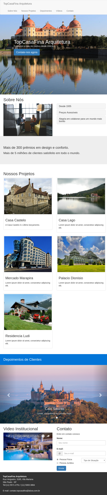

# estudos-bootstrap-alura
  Criação de uma single-page responsiva com Bootstrap. Curso Alura.

# Instalando

  1) Fazer git clone do projeto
  2) Acessar no navegador: http://localhost/estudos-bootstrap-alura/

# Imagens Projeto Final

  1) Mobile:
  
  
  
  2) Tablet:
  
  
  
  3) Desktop:
  
  